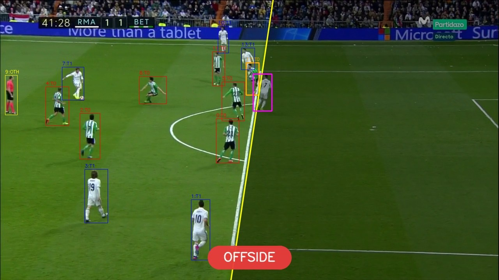

# Football Offside Detection — Computer Vision Pipeline

Source code for Aidan Cristina's B.Sc.(Hons.) Computing Science Final Year
Project (University of Malta, supervisor: Prof. Carl James Debono).



*Example pipeline output: bounding boxes are colour-coded by team, the yellow line is the offside line projected back into the image, and the verdict is displayed at the foot of the frame.*

The full write-up — motivation, related work, design rationale, evaluation,
and discussion — lives in [`report/dissertation/main.pdf`](report/dissertation/main.pdf).
This README only covers what you need to **run** the code.

---

## Dataset access

This project uses the [SoccerNet](https://www.soccer-net.org/) dataset for
match footage and event annotations. To reproduce the pipeline from scratch
you must first request access:

1. Register at <https://www.soccer-net.org/data> and agree to the dataset
   licence.
2. Once approved you will receive the download password. Replace the
   `PASSWORD` constant in `download_videos.py` with your own credential.
3. Use `scan_offsides.py` to identify games with high offside counts, then
   add the desired game paths to the `games` list in `download_videos.py`.

The SoccerNet password used in this project (`s0cc3rn3t`) is the publicly
documented community password referenced in the original dataset paper and
is not a private credential.

---

## Requirements

- Python 3.11
- `ffmpeg` on the system PATH (used by `extract_clips.py`)
- GNU `make` (drives the pipeline)
- An NVIDIA GPU is recommended for `team_identification.py`
  (YOLO11x-seg) but not required.
- All scripts must be run from the project root directory, not from within
  a subdirectory.

Install Python dependencies:

```bash
pip install -r requirements.txt
```

If you do not have a CUDA 12.1 GPU, install `torch` separately from
<https://pytorch.org/get-started/locally/> before the line above.

---

## Running the pipeline

The whole pipeline is orchestrated by the [Makefile](Makefile). Stages are
idempotent — re-running any stage only processes new or stale items.

```bash
# 0. (optional) scan the dataset to identify high-offside games:
python scan_offsides.py

# 1. (manual, one-off) download chosen match videos:
python download_videos.py

# 2. build everything that is currently stale:
#    this runs clip extraction, team identification, and homography computation.
#    three stages launch browser UIs — open the URL printed in the terminal
#    and complete the annotation before pressing Ctrl+C to continue.
make

# 3. open the offside-verdict UI once the build chain is done:
make offside
```

Three of the nine stages are browser-based human-in-the-loop UIs served on
localhost. After `make` launches them, open the URL printed in the terminal
and complete the annotation step before the pipeline can continue:

| Stage | Script | Port |
|------:|--------|------|
| keyframe selection   | `annotate_keyframes.py` | `:5000` |
| pitch-point picking  | `pick_points.py`        | `:5001` |
| offside verdict      | `offside_checker.py`    | `:5002` |

`make help` lists all targets, including `make dry` (preview without
running), `make clean-derived`, and `make clean-all`.

---

## Repository layout

```
.                         pipeline scripts (one per stage)
eval/                     evaluation scripts that back the Chapter 5 numbers
static/                   shared CSS served to all three browser UIs
data/                     all generated artefacts; gitignored
report/dissertation/      LaTeX source for the dissertation
Makefile                  pipeline orchestration
requirements.txt          pinned Python dependencies
```

The first run of `team_identification.py` will auto-download
`yolo11x-seg.pt` (~125 MB) into the project root via Ultralytics. No
manual download step is required.

The pipeline DAG, the design choices behind each stage, and a discussion of
the evaluation results are all in the dissertation — please read it for
anything beyond "how do I get this running."
